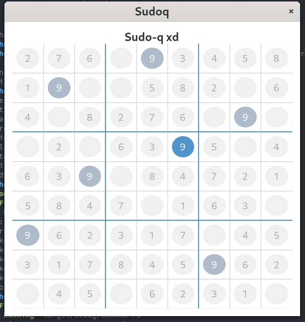

# sudo-q

I created this Sudoku implementation to learn more about Rust and GTK. 

I don't think this follows idiomatic Rust and GTK since I am learning them for the first time.
Hopefully in the future I will refactor these to follow the community guidelines.



## How to run
1. Be sure you have gtk4 installed. You can follow [these instructions](https://gtk-rs.org/gtk4-rs/git/book/installation.html)
2. Run as expected with Cargo:
   ```
   git clone git@github.com:wichops/sudo-q.git
   cd sudo-q
   cargo run
   ```

## TODO
- Add a list of numbers to the bottom
- Add a timer
- Save game state

